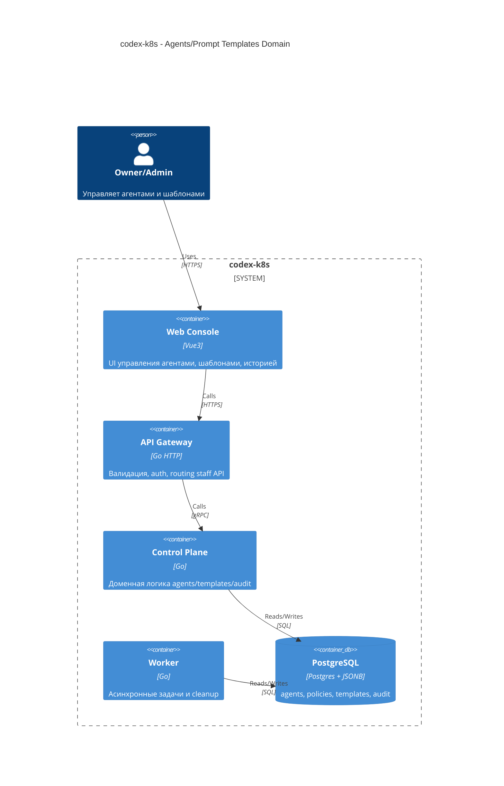

# Agents configuration and prompt templates lifecycle architecture

## TL;DR
- Доменные контуры `agents settings`, `prompt templates lifecycle`, `audit/history` остаются внутри `services/internal/control-plane`.
- Транспорт остаётся thin-edge: `services/external/api-gateway` валидирует/маршрутизирует, `services/staff/web-console` отвечает только за UX.
- Жизненный цикл шаблонов строится на версионировании `prompt_templates` и audit trail через `flow_events` и `agent_sessions`.
- НФР: безопасность (RBAC, шифрование, запрет секретов), аудит (correlation_id и append-only), observability, latency budget для UI.

## Контекст и цель
Инициатива S6 `Agents configuration and prompt templates lifecycle` следует за цепочкой #184 -> #185 -> #187 -> #189.
PRD-пакет сформирован в рамках Issue #187 и смержен в `main` через PR #190.

Цель архитектурного этапа:
- закрепить сервисные границы и ownership данных для `agents/templates/audit`;
- описать контейнерный уровень (C4) и основные потоки;
- сформировать архитектурные решения, риски и mitigation;
- подготовить handover-пакет в `run:design`.

## Scope
In scope:
- доменные границы для управления агентами и шаблонами промптов;
- lifecycle шаблонов `work/revise` с локалями и версионированием;
- аудит изменений и история действий.

Out of scope:
- детальные API/DTO и реализация UI/backend;
- изменения label taxonomy и trigger-политики.

## Нефункциональные ограничения (NFR baseline)
- Security: RBAC по проекту, доступ к edit только для admin, секреты не логируются.
- Auditability: каждый write фиксируется в `flow_events` с `correlation_id` и actor.
- Observability: метрики/события для latency и ошибок edit/preview.
- UX latency budget: P95 list/preview <= 300ms, diff <= 1000ms, audit list <= 500ms.

## C4 Container (domain view)

## Границы сервисов и ownership
- `services/external/api-gateway`: только transport validation/auth/routing, без доменных правил.
- `services/internal/control-plane`: единственный владелец доменной логики и схемы БД для agents/templates/audit.
- `services/jobs/worker`: фоновые и идемпотентные задачи (cleanup, возможные асинхронные операции по audit/metrics).
- `services/staff/web-console`: UX, редакторы и визуализация diff/preview, без бизнес-логики и прямого доступа к БД.

## Ownership данных и модель lifecycle
Базовые сущности (уже в data model):
- `agents`, `agent_policies`, `prompt_templates`, `agent_sessions`, `flow_events`.

Целевой lifecycle шаблонов:
- новое изменение всегда создаёт новую версию `prompt_templates` с признаком `is_active=false`;
- активация версии выполняется отдельной операцией и делает её единственной активной;
- rollback = активация предыдущей версии (без удаления истории).

Кандидатные расширения для design-этапа:
- поля `status` (`draft|active|archived`), `change_reason`, `checksum`, `updated_by`, `supersedes_version`;
- optimistic concurrency через `expected_version` в write-потоке.

## Основные потоки
### Управление агентами
- UI читает список агентов и настроек через staff API.
- Изменения настроек агента сохраняются в `control-plane` и фиксируются в `flow_events`.

### Управление шаблонами промптов
- UI получает список шаблонов по `scope` (global/project) и ключу `(role, kind, locale)`.
- Preview/effective preview формируются `control-plane` с применением политики fallback (project -> system -> en).
- Diff строится по версиям `prompt_templates` и отображается в UI.
- Каждое изменение создаёт новую версию и порождает audit event.

### Audit/History
- Все write-операции пишут событие в `flow_events` (append-only) и связываются с `agent_sessions`.
- История для UI строится из комбинации `prompt_templates` версий и `flow_events`.

## Policy enforcement
- RBAC: edit-операции доступны только admin; read доступен read/read_write.
- Locale policy: базовый минимум `ru` и `en`; fallback запрещает silent drop missing locale.
- Label taxonomy не меняется, transitions проходят через MCP policy/audit контур.

## Observability
- Метрики: latency list/preview/diff, ошибка валидации, конфликт версий.
- Audit события: `agent.settings.updated`, `prompt_template.version.created`, `prompt_template.version.activated`, `prompt_template.preview.generated`.

## Риски и mitigation
- Конфликт параллельных правок. Mitigation: optimistic concurrency (`expected_version`) + явная ошибка `conflict`.
- Неполный audit trail при сбое записи. Mitigation: транзакция `template write + flow_event`.
- Тяжёлые diff на больших шаблонах. Mitigation: лимит размера, приоритет server-side diff и кэширование.
- Drift между seed и DB overrides. Mitigation: явный indicator source + checksum в UI.

## Handover в `run:design`
Обязательные design-артефакты:
- OpenAPI контракты staff API для agents/templates/audit lifecycle.
- gRPC контракты `api-gateway -> control-plane` и typed DTO/casters.
- Обновления data model и миграции (если вводятся новые поля/таблицы).
- UI flow и state-management для agents/templates (list, diff, preview, history).
- Политика RBAC и error taxonomy (`invalid_argument`, `conflict`, `forbidden`).
- План observability и тестирования (unit + integration + UI).

## Результаты `run:design` (Issue #195)
- `docs/architecture/agents_prompt_templates_lifecycle_design_doc.md`
- `docs/architecture/agents_prompt_templates_lifecycle_api_contract.md`
- `docs/architecture/agents_prompt_templates_lifecycle_data_model.md`
- `docs/architecture/agents_prompt_templates_lifecycle_migrations_policy.md`
- `docs/delivery/epics/s6/epic-s6-day5-agents-prompts-design.md`
- Continuity: создана follow-up issue `#197` для stage `run:plan`.

## Migration и runtime impact
- На этапе `run:arch` runtime-поведение не меняется: изменения ограничены архитектурной документацией.
- На этапе `run:design` требуется зафиксировать миграционный план для `prompt_templates` (дополнительные поля/индексы) с владельцем схемы `services/internal/control-plane`.
- Порядок внедрения для последующего `run:dev`: `migrations -> internal domain services -> edge services -> frontend`.
- Обратная совместимость не является обязательной для этой инициативы (проект в ранней стадии), но миграции должны оставаться идемпотентными и с явным rollback-подходом.

## Dependency baseline (Context7)
- Проверка по `kin-openapi` (`/getkin/kin-openapi`) подтверждает достаточность текущего подхода request/response validation для contract-first staff API.
- Проверка по `monaco-editor` (`/microsoft/monaco-editor`) подтверждает, что `DiffEditor` покрывает use-case сравнения шаблонов без отдельной diff-библиотеки.
- Следствие: на этапе `run:arch` новые внешние зависимости не требуются.

## Подтверждённые решения Owner (2026-02-25)
1. Отдельный журнал `prompt_template_changes` не нужен: достаточно версий `prompt_templates` + `flow_events`.
2. Diff версий хранить как отдельный артефакт не требуется: вычисление выполняется на лету.
3. Soft-lock в UI не вводится: используется optimistic concurrency как основной механизм защиты от гонок.

## Связанные документы
- `docs/architecture/data_model.md`
- `docs/architecture/prompt_templates_policy.md`
- `docs/architecture/api_contract.md`
- `docs/product/requirements_machine_driven.md`
- `docs/delivery/epics/s6/epic-s6-day4-agents-prompts-arch.md`
- `GitHub issue #187` (PRD stage source)
- `GitHub PR #190` (merged PRD package in `main`)
- `GitHub issue #195` (follow-up stage `run:design`)
