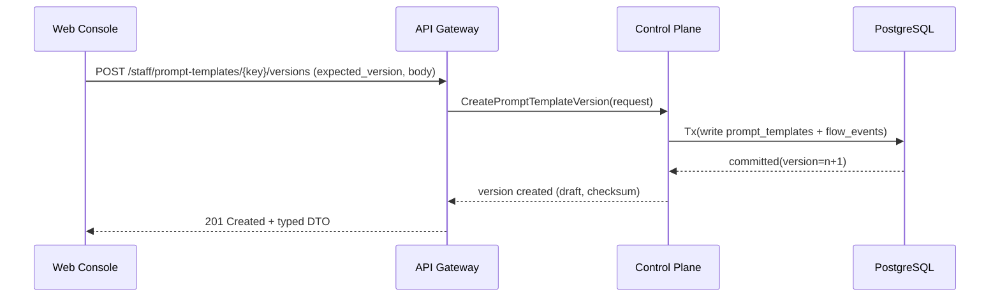
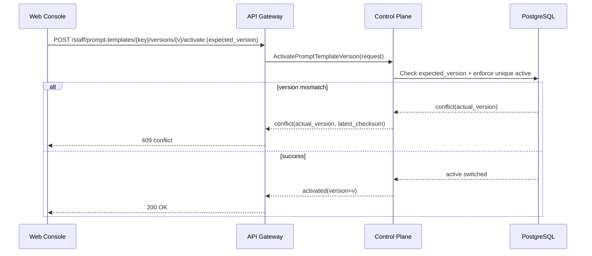

# Detailed Design: agents settings and prompt templates lifecycle

## TL;DR
- Что меняем: фиксируем design-уровень для staff API/gRPC/data/UI контуров управления `agents/templates/audit`.
- Почему: `run:arch` (#189) закрепил границы и ADR-0009, но для `run:dev` нужен детальный контракт handover.
- Основные компоненты: `api-gateway` (thin-edge), `control-plane` (domain owner), `worker` (background reconciliation), `web-console` (UX/state).
- Риски: гонки версий шаблонов, drift preview/diff, неполный audit trail.
- План выката: `migrations -> control-plane -> api-gateway -> web-console`, без runtime-изменений на этапе `run:design`.

## Цели / Не-цели
### Goals
- Зафиксировать typed API boundaries для `agents/templates/audit`.
- Формализовать error/validation/concurrency контракт lifecycle шаблонов.
- Детализировать data model и миграционный подход для `prompt_templates`.
- Описать UI/state flow для list/details/diff/preview/history.
- Подготовить acceptance-критерии handover в `run:plan` и далее в `run:dev`.

### Non-goals
- Реализация backend/frontend кода.
- Изменение label taxonomy (`run:*`, `state:*`, `need:*`).
- Пересмотр базовых архитектурных границ, утвержденных в `run:arch`.

## Контекст и текущая архитектура
- Source architecture: `docs/architecture/agents_prompt_templates_lifecycle_design.md`.
- Контур ответственности:
  - `services/external/api-gateway`: auth/validation/routing.
  - `services/internal/control-plane`: domain rules + schema ownership.
  - `services/jobs/worker`: идемпотентные фоновые задачи.
  - `services/staff/web-console`: stateful UX без доменной логики.
- Текущая проблема: отсутствует детализированный contract package для разработки `agents/templates/audit`.

## Предлагаемый дизайн (high-level)
### Компоненты и boundaries
- `web-console` использует только staff HTTP DTO из OpenAPI-контракта.
- `api-gateway` выполняет input/output validation и маппинг HTTP DTO <-> gRPC DTO через typed casters.
- `control-plane` выполняет доменные use-case:
  - update agent settings;
  - create template draft version;
  - activate template version;
  - effective preview;
  - diff versions;
  - audit history listing.
- `worker` опционально обслуживает background maintenance:
  - архивация старых template versions;
  - пересчет derived preview cache (если включается в `run:dev`).

### Потоки данных
1. User edits template in `web-console`.
2. `api-gateway` валидирует payload (schema + business pre-check на edge).
3. `control-plane` выполняет optimistic concurrency, пишет новую version и `flow_event` в одной транзакции.
4. UI получает typed response с `version`, `status`, `checksum`, `conflict_hint` (при конфликте).

## API/Контракты
- Детализация HTTP/gRPC: `docs/architecture/agents_prompt_templates_lifecycle_api_contract.md`.
- Source of truth для реализации в `run:dev`:
  - OpenAPI: `services/external/api-gateway/api/server/api.yaml`.
  - gRPC: `proto/codexk8s/controlplane/v1/controlplane.proto`.
- Error taxonomy:
  - `invalid_argument`, `unauthorized`, `forbidden`, `not_found`, `conflict`, `failed_precondition`, `internal`.
- Concurrency contract:
  - mutating operations принимают `expected_version`;
  - conflict response возвращает `actual_version` и `latest_checksum`.

## Модель данных и миграции
- Детализация сущностей: `docs/architecture/agents_prompt_templates_lifecycle_data_model.md`.
- Миграционный подход: `docs/architecture/agents_prompt_templates_lifecycle_migrations_policy.md`.
- Ключевая стратегия:
  - расширить `prompt_templates` полями version-state/checksum/audit-metadata;
  - сохранить модель ADR-0009 (без отдельной audit-table для template changes);
  - обеспечить инвариант «одна active версия на template key» через partial unique index.

## Сценарии (Sequence diagrams)

## Нефункциональные аспекты
- Надёжность:
  - transactional write `template version + flow_event`;
  - idempotency-key для mutating HTTP операций (план на `run:dev`).
- Производительность:
  - P95 targets: list <= 300ms, preview <= 600ms, diff <= 1200ms, audit list <= 500ms.
- Безопасность:
  - RBAC edit-only для project admin;
  - контент шаблонов не содержит секреты; validation блокирует known secret-like patterns.
- Наблюдаемость:
  - structured logs с `correlation_id`, `project_id`, `template_key`, `version`.

## Наблюдаемость (Observability)
- Логи:
  - `prompt_template.version.created`
  - `prompt_template.version.activated`
  - `prompt_template.preview.generated`
  - `agent.settings.updated`
- Метрики:
  - `prompt_template_write_total{operation,status}`
  - `prompt_template_conflict_total`
  - `prompt_template_preview_latency_ms`
  - `prompt_template_diff_latency_ms`
- Трейсы:
  - span path `staff-http -> cp-grpc -> repository -> postgres`.
- Дашборды/алерты:
  - conflict rate > 5% за 15m;
  - preview/diff p95 выше target 3 окна подряд.

## Тестирование
- Юнит:
  - use-case tests для lifecycle/status transitions/conflict branches.
- Интеграция:
  - repository tests на partial unique indexes и transactional audit write.
- Contract tests:
  - OpenAPI schema validation;
  - gRPC transport mapping tests (typed DTO/casters).
- UI tests:
  - state-machine tests для editor/diff/preview/history.
- Security checks:
  - RBAC negative scenarios;
  - secret-like content guardrail checks.

## План выката (Rollout)
- На этапе `run:design` runtime не меняется (markdown-only).
- Целевой rollout в `run:dev`:
  1. DB migrations (owner: `control-plane`).
  2. `control-plane` domain/repository/transport updates.
  3. `api-gateway` HTTP handlers + OpenAPI regeneration.
  4. `web-console` integration (typed client + state flow).
- Feature flags (planned):
  - `CODEXK8S_PROMPT_TEMPLATES_V2_ENABLED` (read/write cutover).

## План отката (Rollback)
- Триггеры:
  - рост `conflict`/`internal` ошибок выше SLO;
  - критичный regress preview/diff.
- Шаги:
  1. Отключить write-path flag.
  2. Оставить read-path на last stable version.
  3. Сохранить исторические версии и audit trail.
- Проверка успеха:
  - error-rate нормализован;
  - list/preview/diff latency вернулись в baseline.

## Альтернативы и почему отвергли
- Отдельные `prompt_template_versions`/`prompt_template_audit` таблицы на этом этапе отвергнуты (см. `ALT-0001`): выше стоимость и migration risk без необходимости для текущего scope.
- Git-only workflow для шаблонов отвергнут как out-of-scope для S6 (потеря UX velocity).

## Runtime impact / Migration impact
- Runtime impact (`run:design`): отсутствует, так как change-set ограничен markdown-документацией.
- Migration impact (`run:dev`): расширение `prompt_templates`, индексы, backfill, staged rollout согласно migration policy.

## Acceptance criteria для handover в `run:plan`
- [x] Подготовлены `design_doc`, `api_contract`, `data_model`, `migrations_policy`.
- [x] Зафиксированы error/validation/concurrency контракты lifecycle.
- [x] Описаны runtime/migration impacts и rollout order.
- [x] Обновлены traceability документы (`issue_map`, `requirements_traceability`).

## Апрув
- request_id: owner-2026-02-25-issue-195-design
- Решение: approved
- Комментарий: Дизайн-пакет готов к handover в `run:plan`.
