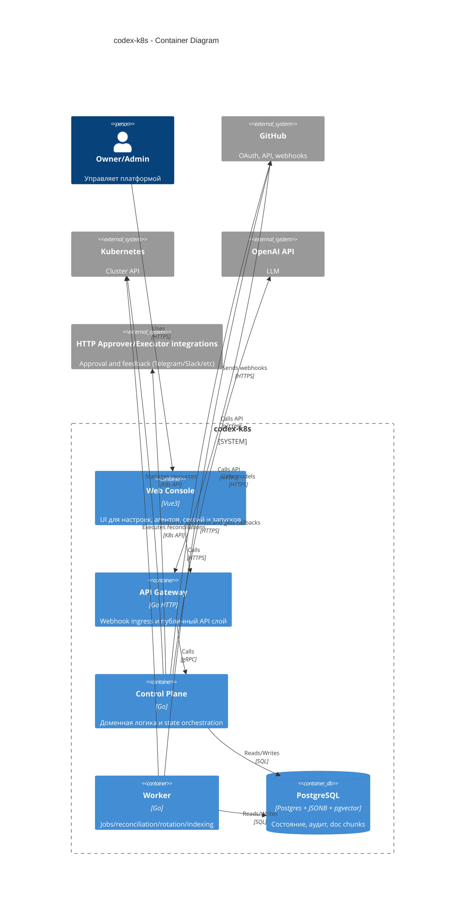

# C4 Container: codex-k8s

## TL;DR
- Основные контейнеры: `web-console`, `api-gateway`, `control-plane`, `worker`, `postgres`.
- Технологии: Vue3, Go, PostgreSQL (`JSONB` + `pgvector`).
- Потоки данных: webhook и UI/label запросы -> stage orchestration -> DB sync/audit -> k8s/repo actions -> PR/feedback.

## Диаграмма (Mermaid C4Container)

## Контейнеры (описание)

### Web Console

* Ответственность: UI для пользователей, проектов, агентов, сессий, документов и журналов.
* Деплой: `services/staff/web-console`.
* Риски: рассинхрон прав в UI при кешировании.

### API Gateway

* Ответственность: webhook validation, auth, routing, edge policies.
* Контракты: OpenAPI для внешнего API.
* Ограничения: без бизнес-логики orchestration и без прямых postgres-репозиториев.

### Control Plane

* Ответственность: доменные use-cases, stage transitions, label policies, prompt template resolution, policy checks.
* Контракты: внутренние service APIs + provider interfaces.
* Ограничения: нет vendor-specific логики в домене.

### Worker

* Ответственность: long-running jobs, retries, reconciliation, rotation, indexing, lifecycle issue/run namespaces.
* Дополнительно: learning-mode post-PR explanations (file/line comments + summary).
* Ограничения: идемпотентность и запись статуса в БД обязательны.

### DB

* Схема/миграции: goose migrations.
* Топология MVP: один PostgreSQL cluster с отдельным логическим контуром для `flow_events`, `agent_sessions`, `token_usage`, `links` и `doc_chunks`.
* Read replica MVP: минимум одна asynchronous streaming replica.
* Эволюция без миграций приложения: переход к 2+ replica и sync/quorum режимам при необходимости.
* Резервирование/бэкап: staging backup baseline обязателен.

## Решения Owner

* Для audit/log/chunks на MVP выделяется отдельный логический БД-контур в рамках PostgreSQL.
* Read replica до production: минимум одна асинхронная streaming replica с архитектурным заделом на масштабирование без изменений приложения.

## Апрув

* request_id: owner-2026-02-06-mvp
* Решение: approved
* Комментарий: Контейнерная архитектура MVP утверждена.
