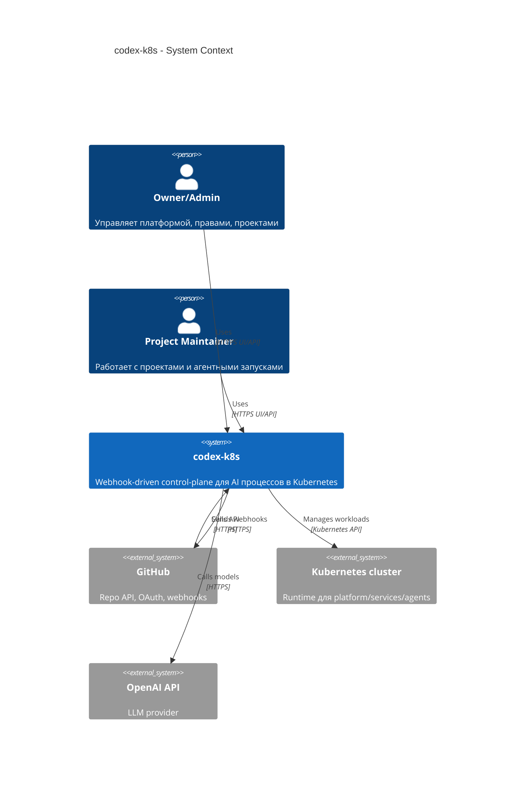

# C4 Context: codex-k8s

## TL;DR
- Система в контуре: `codex-k8s` control-plane.
- Пользователи: Owner/Admin/Project Maintainer.
- Внешние зависимости: GitHub API/Webhooks, Kubernetes API, OpenAI API.

## Диаграмма (Mermaid C4Context)

## Пояснения

- Основные взаимодействия: webhook ingest -> domain orchestration -> k8s/repo actions -> audit/state in Postgres.
- Границы ответственности: `codex-k8s` управляет процессами и состоянием, но не заменяет GitHub и Kubernetes как системы-источники соответствующих фактов.

## Внешние зависимости

- GitHub: OAuth, repo/webhook operations, PAT/service tokens.
- Kubernetes: runtime для сервисов платформы и агентных pod/namespace lifecycle.
- OpenAI: модельные вызовы и токены использования.

## Решения Owner

- Отдельный provider для enterprise GitHub/GHE на этапе MVP не требуется.
- Production OpenAI account подключается сразу.

## Апрув

- request_id: owner-2026-02-06-mvp
- Решение: approved
- Комментарий: Внешние зависимости на MVP утверждены.
