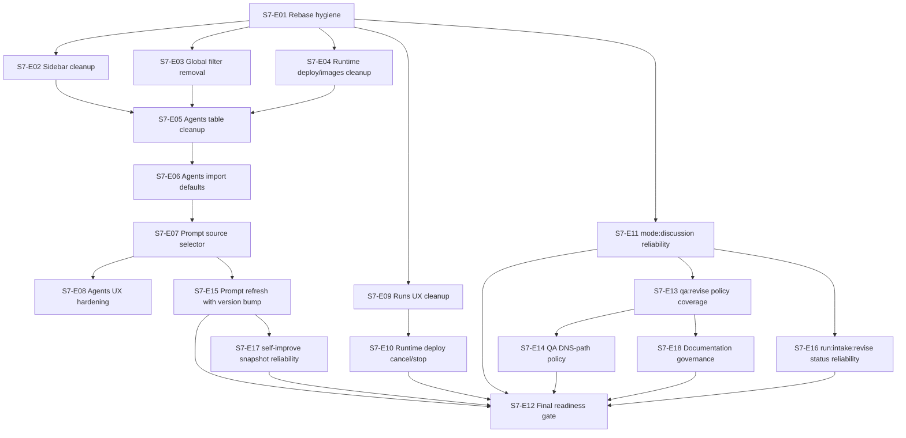

# Epic S7 Day 3: PRD для закрытия MVP readiness gaps (Issue #220)

## TL;DR
- Подготовлен PRD-пакет Sprint S7 для потоков `S7-E01..S7-E18` с формализацией `user story`, `FR`, `AC`, `NFR`, `edge cases`, `expected evidence`.
- Зафиксированы dependency graph и execution sequencing для перехода `run:prd -> run:arch -> run:design -> run:plan`.
- Подтверждено governance-правило decomposition parity перед входом в `run:dev`: `approved_execution_epics == run:dev implementation issues`.
- Создана follow-up issue `#222` для stage `run:arch` без trigger-лейбла.

## Priority
- `P0`.

## Контекст
- Intake baseline: `#212` (`docs/delivery/epics/s7/epic-s7-day1-mvp-readiness-intake.md`).
- Vision baseline: `#218` (`docs/delivery/epics/s7/epic-s7-day2-mvp-readiness-vision.md`).
- Текущий этап: `run:prd` в Issue `#220`.
- Следующий этап: `run:arch` в Issue `#222`.

## Scope
### In scope
- PRD-декомпозиция по `S7-E01..S7-E18` с FR/AC/NFR.
- Формализация sequencing/dependencies для архитектурного handover.
- Фиксация parity-gate правила и критериев блокировки при mismatch.
- Синхронизация traceability (`issue_map`, `requirements_traceability`, sprint/epic docs).

### Out of scope
- Кодовые изменения.
- Изменение архитектурных границ вне PRD-детализации.
- Запуск `run:arch` trigger-лейбла (ставит Owner после review).

## PRD package
- `docs/delivery/epics/s7/prd-s7-day3-mvp-readiness-gap-closure.md`
- Пакет включает:
  - 18 execution-stream спецификаций (`S7-E01..S7-E18`);
  - stream-level `user story + FR + AC + NFR + edge cases + expected evidence`;
  - dependency graph, sequencing-waves и transition rules;
  - риски и продуктовые допущения для handover в `run:arch`.

## Execution sequencing и dependency graph

### Sequencing waves
- Wave 1 (foundation): `S7-E01`, `S7-E11`, `S7-E13`.
- Wave 2 (UI cleanup): `S7-E02`, `S7-E03`, `S7-E04`, `S7-E05`.
- Wave 3 (agents lifecycle): `S7-E06`, `S7-E07`, `S7-E08`, `S7-E15`, `S7-E17`.
- Wave 4 (runs/deploy reliability): `S7-E09`, `S7-E10`, `S7-E16`.
- Wave 5 (QA/governance closeout): `S7-E14`, `S7-E18`, `S7-E12`.

## Governance rules
- Rule G-01 (continuity): каждая stage-issue обязана создать следующую stage-issue без trigger-лейбла.
- Rule G-02 (parity): до входа в `run:dev` должно выполняться `approved_execution_epics == run:dev implementation issues`.
- Rule G-03 (block): при `coverage_ratio != 1.0` переход в `run:dev` блокируется и эскалируется через `need:input`.

## Acceptance criteria (Issue #220)
- [x] PRD-артефакт S7 подготовлен и синхронизирован в traceability-документах.
- [x] Для `S7-E01..S7-E18` зафиксированы `user story`, `FR/AC/NFR`, `edge cases`, `expected evidence`.
- [x] Зафиксирован execution sequencing и dependency graph для перехода в `run:arch`.
- [x] Зафиксировано и проверяемо parity-правило decomposition перед `run:dev`.
- [x] Создана follow-up issue `#222` для stage `run:arch` без trigger-лейбла.

## Quality gates
| Gate | Что проверяем | Статус |
|---|---|---|
| QG-S7-D3-01 PRD completeness | Полное покрытие `S7-E01..S7-E18` по `user story/FR/AC/NFR` | passed |
| QG-S7-D3-02 Sequencing determinism | Dependency graph и wave-последовательность формализованы | passed |
| QG-S7-D3-03 Parity governance | Правило `approved_execution_epics == run:dev implementation issues` закреплено | passed |
| QG-S7-D3-04 Stage continuity | Создана issue `#222` для `run:arch` без trigger-лейбла | passed |
| QG-S7-D3-05 Policy compliance | Scope этапа ограничен markdown-only изменениями | passed |

## Handover в `run:arch`
- Следующий этап: `run:arch`.
- Follow-up issue: `#222`.
- Trigger-лейбл `run:arch` на issue `#222` ставит Owner после review.
- Обязательные выходы архитектурного этапа:
  - сервисные границы и ownership по `S7-E01..S7-E18`;
  - contract/data impact и ограничения реализации;
  - architecture-level mitigation для рисков паритета/sequence;
  - создание issue `run:design` без trigger-лейбла.

## Открытые риски и допущения
| Type | ID | Описание | Статус |
|---|---|---|---|
| risk | RSK-220-01 | Без architecture-level ownership по потокам высок риск размывания сервисных границ | open |
| risk | RSK-220-02 | При нарушении sequencing-waves возможны конфликтующие implementation-issues и rework | open |
| risk | RSK-220-03 | При несоблюдении parity-гейта dev-stage стартует с неполным execution-scope | open |
| assumption | ASM-220-01 | Owner подтверждает переход в `run:arch` после review PRD-пакета | accepted |
| assumption | ASM-220-02 | Для `S7-E01..S7-E18` не требуется изменение базовой label taxonomy | accepted |
